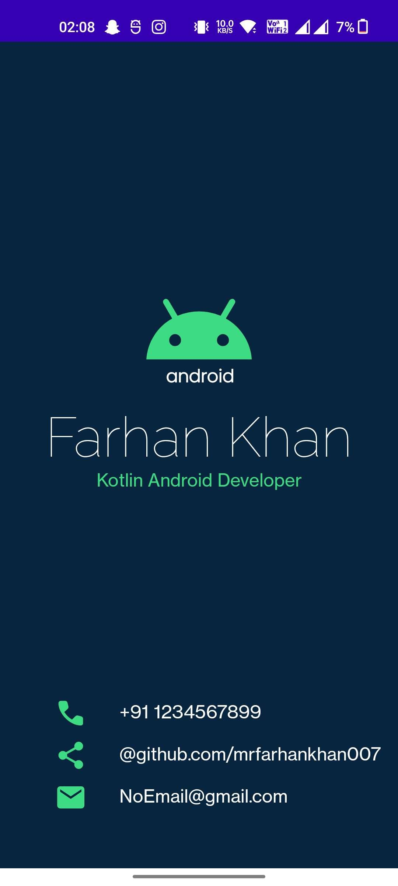

# BusinessCardApp 📇
<!--  -->

BusinessCardApp is a simple project that allows users to create and display a digital business card. This project is developed using Kotlin and is perfect for anyone who wants to create a professional-looking business card for themselves or their company. The user-friendly interface of BusinessCardApp makes it easy to use and is perfect for both beginners and advanced users. 👨‍💼💼

## Features 🚀
1. Create a professional-looking digital business card. 📈👔

2. Display your contact information on the business card. 📞📧

3. User-friendly interface. 👨‍💻

4. Easy to use. 🤙

## Getting Started 🏁

1. To get started with BusinessCardApp, follow these steps:

2. Clone this repository to your local machine.

" git clone https://github.com/MrFarhanKhan007/BusinessCardApp.git "

3. Open the project in your preferred Kotlin IDE.

4. Modify the contact information in the MainActivity.kt file to match your own.

5. Run the MainActivity.kt file to launch the application.

6. Your digital business card will be displayed on the screen. 📱💻

## Contributing 🤝
Contributions to BusinessCardApp are welcome! If you find a bug or have an idea for a new feature, please open an issue or submit a pull request. 🙌
